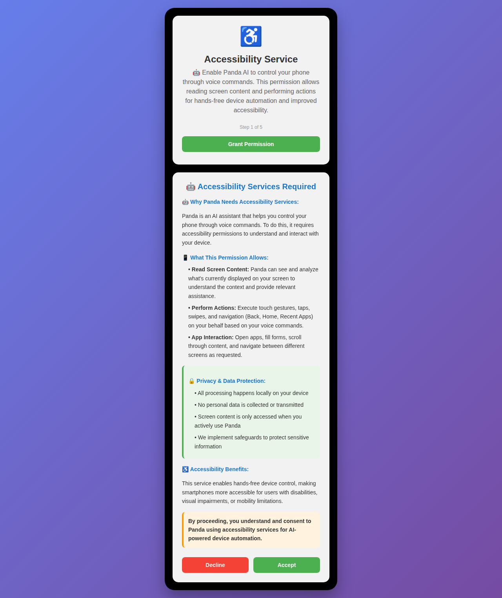

# Accessibility Services Disclosure Improvements

## Overview
This document outlines the improvements made to the accessibility services disclosure in the Panda app to ensure compliance with Google Play policies and provide users with comprehensive information about why and how accessibility services are used.

## Problem Statement
The original issue stated: "The prominent disclosure in your app must explain why your app requires use of the AccessibilityServices API, and how it's used. There is a disclosure present in the onboarding page, you must improve that disclosure."

## Changes Made

### 1. Enhanced Main Disclosure (`accessibility_permission_details`)

**Before:**
- Basic bullet points about seeing and interacting with screen
- Brief privacy mention
- Simple accessibility benefit statement

**After:**
- **Clear purpose explanation**: Why Panda needs accessibility services (AI assistant for voice control)
- **Detailed capabilities**: Comprehensive list of what the permission allows
- **Privacy emphasis**: Prominent section on data protection and local processing
- **Accessibility benefits**: Specific mention of disability support and mobility limitations
- **Explicit consent**: Clear statement requiring user understanding and consent
- **Visual improvements**: Added emojis for better readability and prominence

### 2. Improved Onboarding Description (`accessibility_permission_full_desc`)

**Before:**
```
This permission is required to read on-screen content and perform actions on your behalf.

This allows the app to automate tasks and provide voice commands for any app. We do not collect personal data.
```

**After:**
```
🤖 Panda is an AI assistant that needs accessibility services to control your phone through voice commands.

This permission allows Panda to:
• Read screen content to understand context
• Perform touches, swipes, and navigation
• Automate tasks across all apps

🔒 Your privacy is protected - all processing happens locally on your device.
```

### 3. Enhanced Service Description (`accessibility_service_description`)

**Before:**
```
To enable "Panda", our digital assistant, this service allows the app to listen for commands and perform actions like tapping and swiping. This is essential for controlling your phone with your voice.
```

**After:**
```
Panda AI Assistant uses accessibility services to provide voice-controlled device automation. This allows hands-free operation of your phone through AI-powered commands, making technology more accessible. The service reads screen content and performs actions only when actively requested by you.
```

### 4. Updated Consent Dialog (`accessibility_consent_title` & `accessibility_consent_message`)

**Before:**
- Generic "Accessibility Permission" title
- Basic explanation of settings activation

**After:**
- **Prominent title**: "🤖 Accessibility Services Required"
- **Clear purpose**: Explains AI assistant functionality
- **Benefits highlight**: Voice-controlled automation for accessibility
- **Privacy assurance**: Local processing emphasis

### 5. Main Permission Description (`accessibility_permission_desc`)

**Before:**
```
Panda needs this permission to see the elements on your screen and to perform actions like tapping and swiping on your behalf. This is the core permission that allows the agent to operate your phone.
```

**After:**
```
🤖 Enable Panda AI to control your phone through voice commands. This permission allows reading screen content and performing actions for hands-free device automation and improved accessibility.
```

## Visual Preview



The visual preview shows:
1. **Enhanced onboarding stepper** with clear AI assistant branding and accessibility focus
2. **Comprehensive consent dialog** with structured sections, visual prominence, and detailed information

## Key Improvements Summary

1. **Prominence**: Added visual elements (emojis) and structured formatting for better visibility
2. **Clarity**: Clear explanation of purpose (AI assistant for voice control)
3. **Comprehensive**: Detailed breakdown of specific capabilities and use cases
4. **Privacy-focused**: Prominent privacy section emphasizing local processing
5. **Accessibility-centered**: Clear benefits for users with disabilities
6. **Consent-explicit**: Direct statement requiring user understanding and consent
7. **Purpose-driven**: Links all capabilities back to the core AI assistant functionality

## Compliance Benefits

These improvements address Google Play policy requirements by:

- **Explaining WHY**: Clear explanation that Panda is an AI assistant requiring these permissions for voice control
- **Detailing HOW**: Specific breakdown of reading screen content and performing actions
- **Emphasizing Benefits**: Accessibility improvements for users with disabilities
- **Ensuring Privacy**: Clear statements about local processing and data protection
- **Requiring Consent**: Explicit user acknowledgment and consent

## Files Modified

- `app/src/main/res/values/strings.xml`: Updated all accessibility-related string resources

## Implementation Details

The improved disclosure appears in multiple places throughout the app:

1. **Onboarding Stepper**: Short, clear description with AI assistant branding
2. **Consent Dialog**: Comprehensive disclosure with structured sections
3. **System Settings**: Enhanced service description for Android accessibility settings
4. **Permission Requests**: Updated descriptions for all accessibility-related permissions

All changes maintain consistency in messaging while providing the appropriate level of detail for each context.