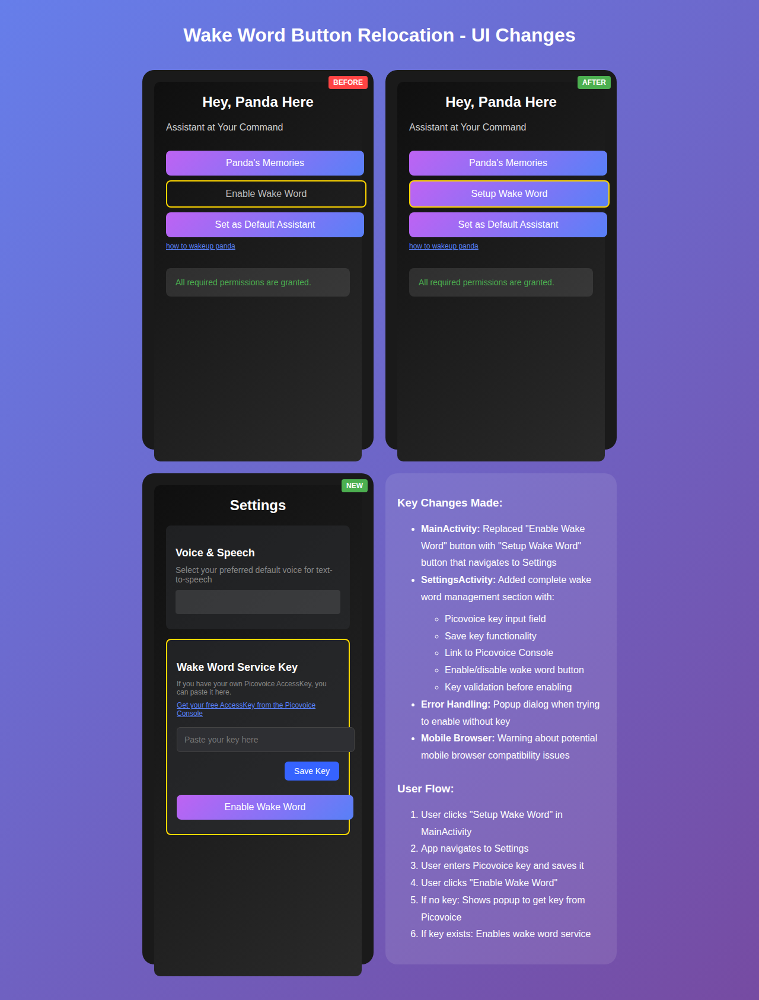

# Wake Word Button Relocation - Implementation Summary

## Issue #234: Move the enable wake word btn on the main activity to the settings, replacing it with the save key btn

### Changes Made

#### 1. MainActivity Changes
- **Removed**: "Enable Wake Word" button functionality
- **Added**: "Setup Wake Word" button that navigates to SettingsActivity
- **Updated**: Button click handler now navigates to settings instead of managing wake word service
- **Cleaned**: Removed wake word state management from main UI update loop

#### 2. SettingsActivity Changes
- **Added**: Complete wake word management section including:
  - Picovoice key input field
  - Save key functionality with validation
  - Link to Picovoice Console with mobile browser warning
  - Enable/Disable wake word button
  - Key validation before enabling wake word service

#### 3. User Flow Improvements
- **Before**: User had to enable wake word directly from main screen without key management
- **After**: User first sets up their key in settings, then can enable wake word
- **Validation**: App now prevents enabling wake word without a valid key
- **Error Handling**: Clear feedback when key is missing or when mobile browser issues occur

#### 4. Technical Implementation
- **Permission Launcher**: Moved to SettingsActivity for wake word microphone permissions
- **Key Management**: Integrated PicovoiceKeyManager for user-provided key storage
- **Dialog System**: Added informative popup for key requirements with Picovoice dashboard link
- **Mobile Compatibility**: Added specific handling for mobile browser limitations

### Screenshots

### Testing
- Added unit test `WakeWordButtonRelocationTest.kt` to verify the new flow
- Manual testing plan documented for UI verification
- Error handling scenarios covered

### User Benefits
1. **Clearer Flow**: Key setup is now separate from wake word activation
2. **Better Error Handling**: Users get clear guidance when key is missing
3. **Mobile Friendly**: Warns about potential mobile browser issues with Picovoice dashboard
4. **Organized Settings**: All wake word configuration is now centralized in settings
5. **Validation**: Prevents enabling wake word without proper configuration

The implementation fully addresses the requirements from issue #234, improving the user experience while maintaining all existing functionality.